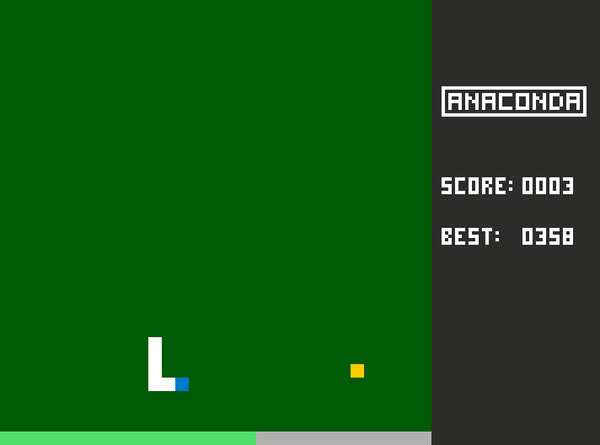

# CPPND: Capstone Snake Game Example

This is a starter repo for the Capstone project in the [Udacity C++ Nanodegree Program](https://www.udacity.com/course/c-plus-plus-nanodegree--nd213). The code for this repo was inspired by [this](https://codereview.stackexchange.com/questions/212296/snake-game-in-c-with-sdl) excellent StackOverflow post and set of responses.

The Capstone Project gives you a chance to integrate what you've learned throughout this program. This project will become an important part of your portfolio to share with current and future colleagues and employers.

In this project, I extended the Snake game in order to change the score system, insert bonus controlled by a bonus bar, storage the best score, render a panel to show scores and draw images to beginning and to game over.

## Score system
  * The snake starts with size 3
  * Each standard food gives one point and increases the snake size and speed
  * For each standard food eaten, the bonus bar is increased
  * The bonus bar fills up after eating 5 standard foods. When this occurs, a bonus food appears
  * The feed bonus score is dynamic. When the bonus food is activated, the bonus bar becomes a timer that counts down 5 seconds. For each second passed, the score for bonus food decreases.
  * 5 points are added for each remaining second of the bonus time. That is, if the bonus food is eaten with 4 seconds remaining, the player gains 20 points. In addition, when eating the bonus food, the speed of the snake is also reduced.

## Which rubric points are addressed.
* [Loops, Functions, I/O]
* A variety of control structures are used in the project.
  * game.cpp -> line 30, 137.
* [Object Oriented Programming]
* The project uses Object Oriented Programming techniques
  * game_score.cpp/game_score.h -> entire files.
* Classes use appropriate access specifiers for class members.
  * game_score.h -> lines 5, 24.
* [Memory Management]
* The project makes use of references in function declarations.
  * renderer.cpp -> lines 45,69.
* The project uses smart pointers instead of raw pointers.
  * game.h -> lines 31.
  * game.cpp -> lines 7, 153.
  * renderer.h -> line 17

## Dependencies for Running Locally
* cmake >= 3.7
  * All OSes: [click here for installation instructions](https://cmake.org/install/)
* make >= 4.1 (Linux, Mac), 3.81 (Windows)
  * Linux: make is installed by default on most Linux distros
  * Mac: [install Xcode command line tools to get make](https://developer.apple.com/xcode/features/)
  * Windows: [Click here for installation instructions](http://gnuwin32.sourceforge.net/packages/make.htm)
* SDL2 >= 2.0
  * All installation instructions can be found [here](https://wiki.libsdl.org/Installation)
  >Note that for Linux, an `apt` or `apt-get` installation is preferred to building from source.
* SDL2_image >= 2.0
  >Note that for Linux, sudo apt-get install libsdl2-image-dev , and libsdl2-image-2.0-0
* gcc/g++ >= 5.4
  * Linux: gcc / g++ is installed by default on most Linux distros
  * Mac: same deal as make - [install Xcode command line tools](https://developer.apple.com/xcode/features/)
  * Windows: recommend using [MinGW](http://www.mingw.org/)

## Basic Build Instructions

1. Clone this repo.
2. Make a build directory in the top level directory: `mkdir build && cd build`
3. Compile: `cmake .. && make`
4. Run it: `./SnakeGame`.

## CC Attribution-ShareAlike 4.0 International

Shield: [![CC BY-SA 4.0][cc-by-sa-shield]][cc-by-sa]

This work is licensed under a
[Creative Commons Attribution-ShareAlike 4.0 International License][cc-by-sa].

[![CC BY-SA 4.0][cc-by-sa-image]][cc-by-sa]

[cc-by-sa]: http://creativecommons.org/licenses/by-sa/4.0/
[cc-by-sa-image]: https://licensebuttons.net/l/by-sa/4.0/88x31.png
[cc-by-sa-shield]: https://img.shields.io/badge/License-CC%20BY--SA%204.0-lightgrey.svg
